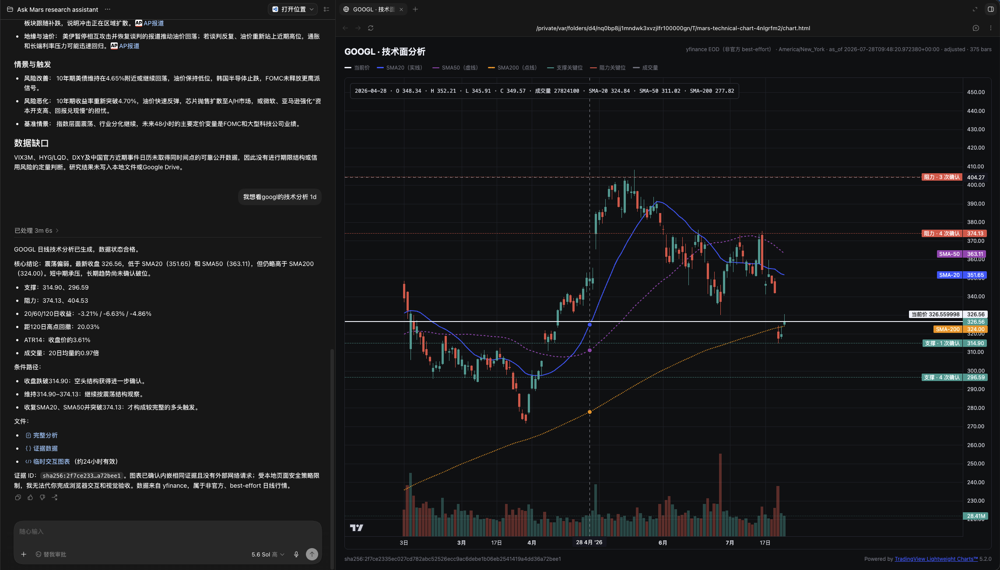

# Mars Research Assistant

一个轻量的投研组合 Skill：根据任务只加载需要的能力、把最终文字研究写成可见的本地 Markdown，
并保留来源、`as_of` 与数据缺口。它不读取账户、不下单、不运行后台监控，也不替用户作交易
决定。

## 安装

v1.0.2 的公开安装入口是 Skills CLI；不再提供下载并执行 shell 脚本的安装方式：

```bash
npx skills add archerthegoat/mars-research-assistant \
  --skill mars-research-assistant \
  --agent codex \
  --global \
  --copy
```

安装只复制 `skills/mars-research-assistant/` 这一个运行包，不复制仓库的测试、开发文档或
Git 元数据，也不会预建 Python、uv 或 yfinance 环境。技术面分析是唯一需要 Python 的子
Skill；它在第一次实际请求时检查 uv，并按包内锁文件创建独立 `.venv`。

## 七个子 Skill

| 任务 | 子 Skill | 交付 |
| --- | --- | --- |
| 决定下一步研究 | Ask Mars | 最小流程、第一步、默认假设和最少输入；不自动研究 |
| 当前市场状态 | 市场快照 | 带来源和时间戳的本地 Markdown 快照 |
| 近期市场事件 | 市场催化剂简报 | 已定事件、发展中风险和传导路径 |
| 快速了解一家公司 | 个股快览（`instrument-research`） | 三项关键公开数据、30 天内 3–5 条公司动态、来源与缺口 |
| 完整基本面与估值 | 深度个股研究（`deep-equity-research`） | 九章研究、四项财报质量检查、数据齐备时的 DCF／反向 DCF |
| 日线结构与关键位 | 技术面分析 | `analysis.md`、`evidence.json` 和临时交互式 HTML |
| 归档已完成研究 | Drive 写入 | 先提议、取得独立明确确认后才初始化或归档 |

没有明确要求深度时，单标的请求默认走“个股快览”；出现深度研究、估值、财报复盘、投资备忘录、
竞争格局或建模时，才使用“深度个股研究”。两者都会先核验公司名称、代码、交易所和发行人；
无法唯一对应时要求澄清，不创建可能归属错误的工件。

## 本地交付与边界

最终文字交付默认写到活动工作目录的 `mars-research/`，使用唯一文件名且绝不覆盖旧文件。
PDF 或 PowerPoint 只在用户要求或确实显著改善图表、比较或叙事时额外生成；Skill 安装目录
不是研究输出目录。Drive 写入仍须单独确认。

个股快览只交付事实：带 `as_of` 的价格、规模/估值锚、最新财务摘要，及最近 30 天的 3–5 条
公司直接相关公告或新闻。它不做估值、技术面、宏观判断或交易建议。

深度研究固定为九章，并将收入/利润/经营现金流一致性、现金转换与应计质量、营运资本信号、
稀释/SBC/审计/治理红旗逐项列为有来源的事实或明确缺口。三情景 DCF 只接收含价格、股本、
净债务、WACC、永续增长率和三条 FCF 路径的可追溯 JSON；缺一项即跳过估值而非猜测数值。所有
研究结论都是可审计材料，不输出买卖、仓位或下单指令。

技术面分析另交付同一证据集的临时 Lightweight Charts HTML；它不访问实时交易服务或刷新行情。



## 开发验证

运行时包与开发仓库分离。离线验证不会请求行情、新闻、Google Drive 或账户：

```bash
bash scripts/verify-mars-skills.sh
```

它会验证七个 Skill 合同、运行包不超过 60 个文件/1 MiB、快览与深度研究 fixture 各在 1 秒内
生成 Markdown，以及技术面既有的确定性验收。真实 yfinance 请求只在发布前的单次集成验收中
运行，不创建定时任务。
