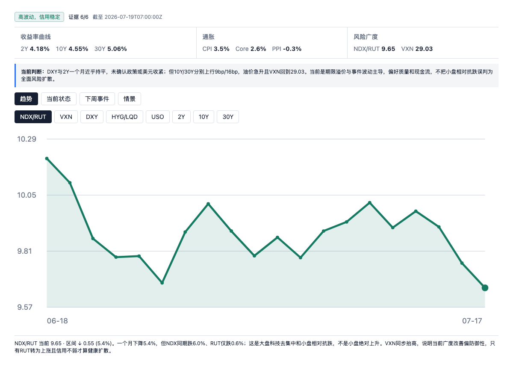
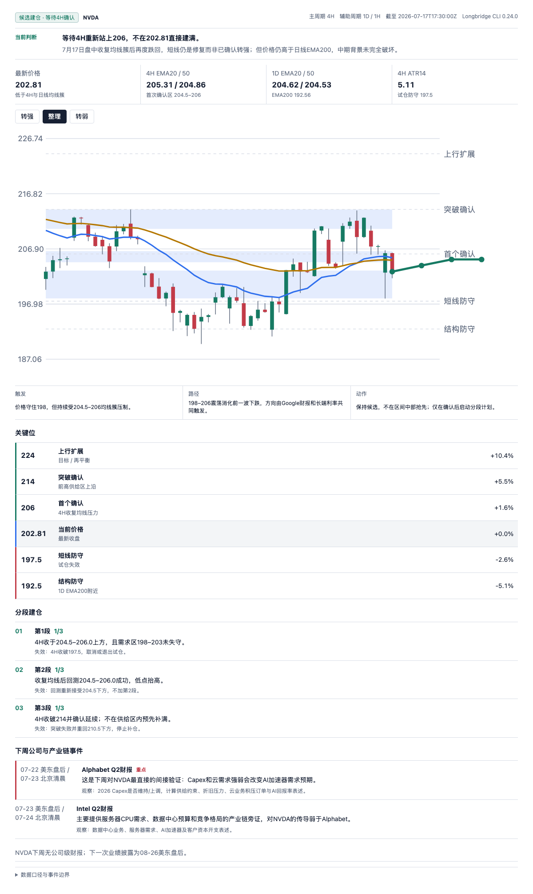

# 火星投研助手

把每天分散的宏观新闻、行业催化、公司财报和价格走势，整理成一份可追踪、可复核的交易研究。

它不是荐股工具，也不会替你下单。它帮助你回答真正影响决策的问题：市场现在在交易什么？事件会传导到哪些行业？一个标的的基本面和技术面是否支持当前的想法？哪些证据会推翻它？



## 适合什么场景

- **开盘前或周末**：快速建立宏观基准，知道本周该盯利率、通胀、油价、政策还是财报。
- **行业事件发生后**：理解一条新闻对半导体、云计算、存储、能源或其他相关链条的实际传导，而不是只追标题。
- **准备研究一只股票**：把行业、基本面、催化、估值、反方风险和 4 小时价格结构放在一起判断。
- **复盘自己的仓位**：在你明确同意后，读取已连接券商的持仓摘要，了解当前暴露，而不替你做交易决定。

## 开始使用

```bash
npx skills@latest add Archerouyang/mars-research-assistant --skill mars-research-assistant -g
```

新开任务后，直接用自然语言开始：

```text
开始今天的交易研究
```

也可以从你最关心的问题进入：

```text
下周宏观要注意什么？
分析 NVDA 的基本面、行业事件和 4H 走势
台积电财报会怎样传导到半导体？
读取我的持仓摘要
```

## 一次研究如何展开

### 1. 先理解市场环境

助手会优先使用你已连接券商提供的市场与宏观数据，并以公开权威来源补齐和核验。你会得到一份宏观研究面板，聚焦利率、通胀、风险偏好、估值、油价、黄金、市场风格和重要事件，而不是一串无关紧要的指标。

当某个关键数据没有可靠来源时，它会明确说明缺什么、尝试过哪些来源，以及这会如何限制结论。不会用不等价的代理指标悄悄替代。

### 2. 再决定是否查看持仓

持仓读取始终需要你的明确同意。读取后只展示研究所需的摘要：券商、标的、数量、最新价格、市值、成本、未实现盈亏、现金与读取时间。

它不会读取订单，不会保存凭证，也不会把私人账户信息写进公开文件。

### 3. 按你的问题研究标的

个股研究不会自动开始。你点名一个标的后，助手才会结合你的问题提供：

- 近期行业与公司事件，以及对收入、利润和资本开支的传导；
- 基本面、估值与关键催化；
- 最强的反方观点和需要验证的事实；
- 日线背景与 4 小时价格行为，明确关键位置、情景与失效条件。



## 设计原则

- **先证据，后观点**：区分已发生事实、市场预期和研究判断。
- **先问，再读账户**：安装 Skill 不代表授权读取券商数据。
- **不确定就说明不确定**：数据不完整时，结论会收窄，而不是用猜测补齐。
- **研究服务于决策，不替代决策**：只提供条件、风险和验证点，不创建、修改或提交真实订单。
- **尊重你的流程**：宏观研究、持仓展示和个股研究可以按你的需要进入，不要求走完固定流程。

## 数据与隐私

- 市场数据优先来自已授权的 Longbridge 或 IBKR；公开权威来源作为补充与兜底。
- 宏观研究使用最近一次共同完成收盘的数据，不混用盘中、盘前或不同交易日的数据。
- 私人持仓、账户信息、运行时计划、凭证和原始券商响应都留在本地，不会进入这个公开仓库。

## 给贡献者

这是一个仅以 Skill 形式发布的研究助手。核心行为说明见 [Skill 契约](skills/mars-research-assistant/SKILL.md)，产品规格见 [火星投研助手 1.0 规格](docs/MARS_RESEARCH_ASSISTANT_1_0_SPEC.md)。

```bash
bash scripts/verify-skill.sh
```

MIT License。第三方组件保留各自许可证，详见 [第三方声明](THIRD_PARTY_NOTICES.md)。
