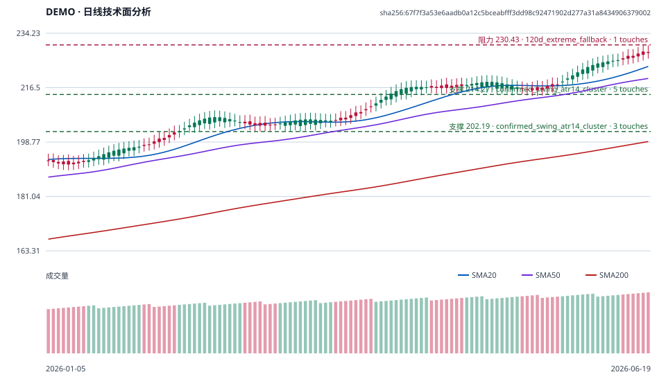

# Mars Skills

面向中文交易研究的独立 Skill 集合。每个 Skill 只交付一种明确结果：研究、建议或经确认后的归档；
不读取账户、不执行交易，也不把多个研究任务混成一次自动操作。

## 快速开始

在仓库根目录一次安装全部六个 Skills：

```bash
bash scripts/install-mars-skill.sh --target /path/to/agent-skills
```

安装器只提供完整安装方式。安装后可以先询问 Ask Mars：

> 下周美股有哪些值得关注的宏观和地缘政治催化剂？之后对 GOOGL 做日线技术面分析。

## 包含的 Skills

| Skill | 交付 | 不会做什么 |
| --- | --- | --- |
| Ask Mars | 推荐最小 Skill 序列、第一步与所需输入 | 不自动研究或写入 |
| 市场催化剂简报 | 已定事件与持续风险的市场催化剂简报 | 不生成交易指令 |
| 市场快照 | 带来源、时间与数据缺口的市场状态摘要 | 不替代事件日历或技术面分析 |
| 标的研究 | 基于 SEC 与发行人 IR 的基本面、行业和公司事件研究 | 不自动加入宏观或技术判断 |
| 技术面分析 | Markdown 分析、可审计 SVG 与 evidence JSON | 不访问账户、不下单 |
| Drive 写入 | 幂等初始化交易研究中心，或归档已完成研究 | 初始化和归档分别确认，未确认时绝不写入 |

## 技术面分析示例

> 以下为确定性合成 `DEMO` fixture 生成的离线示例，非当前市场数据。



对应的 Markdown 摘要：

```markdown
# 技术面分析：DEMO

证据标识：`sha256:67f7f3a53e6aadb0a12c5bceabfff3dd98c92471902d277a31a8434906379002`

## 技术结构
- 当前分类：**多头**。最新收盘 227.82，SMA20 223.42，SMA50 219.49，SMA200 198.93。

## 关键位
- **支撑 214.27**：method=confirmed_swing_atr14_cluster；lookback=120；touches=5。
- **阻力 230.43**：method=120d_extreme_fallback；lookback=120；touches=1。
```

完整示例工件位于 [`examples/technical-analysis-demo/`](examples/technical-analysis-demo/)。
三份文件共享同一个 `evidence_id`，Markdown 只解释 JSON 中的数字，SVG 只可视化同一证据集。

## 数据与安全边界

- 技术面分析只使用 yfinance 的非官方、best-effort OHLCV；不需要 API key，也没有其他数据源或回退路径。
- 日线结论要求带时区、复权 OHLCV、正成交量与合适覆盖范围；少于 319 根已完成日线时整体失败关闭。
- 第一次取数不合格时最多进行一次 yfinance 同源扩大窗口重试，不插值、不合成、不切换来源。
- 所有研究都标记来源、`as_of` 与数据缺口；不把任何凭据放入仓库、Skill、fixture、文档或日志。
- Drive 写入每次从 My Drive 精确解析交易研究中心，只补缺项且不缓存 Drive ID；重复根目录由
  用户选择，不移动、覆盖、重命名或删除已有内容。

## 开发与验证

使用锁定的 `uv` 环境：

```bash
uv sync --locked
bash scripts/verify-mars-skills.sh
```

离线验收只使用 fixture 与临时目录，不请求市场数据、读取账户或写入 Drive。

发布前只运行一次真实 yfinance 契约测试，不创建每日任务：

```bash
uv run python scripts/run_yfinance_contract_test.py \
  --symbol SPY \
  --output-dir /tmp/mars-yfinance-release-check
```
