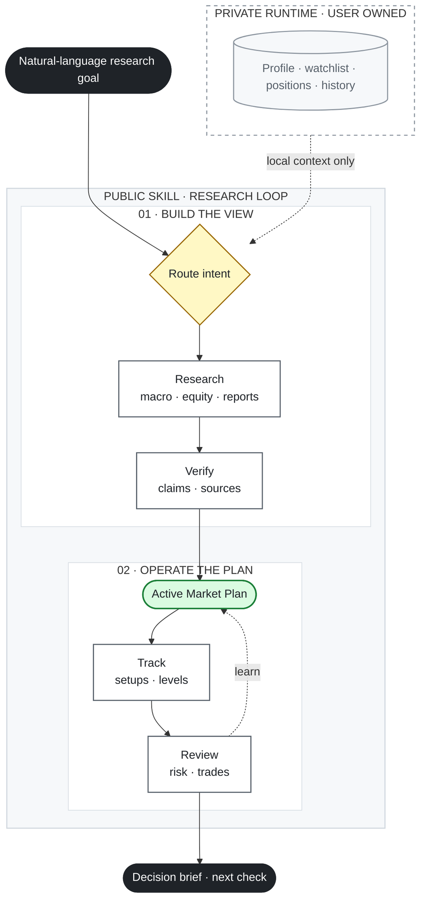

[English](README.md) | [简体中文](README.zh-CN.md)

# DailyTrades: Trading Research System

An AI-native research Skill that compresses market, macro, policy, company,
price-action, and portfolio evidence into an updateable decision process.

Version: `0.1.1`

## Install in 30 Seconds

Install the complete portable Agent Skill. The installer detects supported
coding agents and adapts the target directory.

```bash
npx skills@latest add Archerouyang/dailytrades --skill trading-research-system -g
```

## First Run

Open a new task and say:

```text
Start today's trading research.
```

The same Skill checks runtime health and, when no private runtime exists,
enters blank first-run setup. It confirms a local runtime location and offers
optional authorized read-only data sources. It does not restore or infer a
watchlist, profile, portfolio, plan, credential, connector grant, or research
history.

## Proposed Canonical Research Board Gallery

Staged only. These synthetic, non-interactive captures are hash-linked to the same canonical HTML used by Codex and Claude Code.

### Instrument Research

[Open canonical HTML](docs/assets/canonical-gallery/artifacts/instrument-research/research-brief.html) · non-interactive screenshot · synthetic fixture

### Macro Regime

[Open canonical HTML](docs/assets/canonical-gallery/artifacts/macro-regime/research-brief.html) · non-interactive screenshot · synthetic fixture

### Portfolio Risk

[Open canonical HTML](docs/assets/canonical-gallery/artifacts/portfolio-risk/research-brief.html) · non-interactive screenshot · synthetic fixture

## Workflow



The user describes the research goal in natural language. The Skill selects
the appropriate internal workflow; newcomers do not need to memorize focused
workflow names.

## Capabilities and Sources

| Capability | What the Skill produces | Source rule |
| --- | --- | --- |
| Weekly and daily market work | Active Market Plan changes, event priorities, and next checks | Verify current facts; show only decision-relevant deltas |
| Macro, rates, and policy | Regime posture, transmission paths, and affected plans | Prefer official primary sources; use authorized macro data for values |
| Equity and report research | Thesis, counter-thesis, claim ledger, and verification queue | Public, authorized, or user-provided research only; no paywall bypass |
| Price action | Declared timeframe, trend/range context, levels, and setup conditions | Authorized OHLCV; TradingView Lightweight Charts for canonical visuals |
| Alpha Lab input | Published champion ranks, history deltas, and uncertainty for research priority | Read-only private store; preserve model ranks and continue safely when unavailable |
| Portfolio risk | Concentration, product, theme, broker exposure, and material flags | Authorized read-only broker facts or explicit user input |
| Trade review | Post-order and post-exit context, errors, and lessons | Read-only execution facts plus user confirmation |

When the private Alpha Lab is available, the Skill reads its published champion
ranking as research priority only. It never retrains or re-ranks the model.
Alpha contracts and automation details live in the
[Alpha Lab plan](docs/ALPHA_LAB_PLAN.md).

The system is decision support. It does not promise returns, replace regulated
advice, or turn a data point into an automatic trade instruction.

## Public Skill / Private Runtime

| Public Skill | Private Runtime |
| --- | --- |
| One installable `trading-research-system` package with workflows, references, scripts, blank templates, and synthetic fixtures | User-owned profile, watchlist, positions, Active Market Plan, setups, reviews, credentials, and connector grants |
| Safe to publish and upgrade | Stays outside the repository and every distribution package |
| Starts with no personal defaults | Created only after explicit local write confirmation |

Installation and upgrades never copy, infer, synchronize, or recover private
state. Broker and market integrations are optional, separately authorized, and
read-only. **No order actions:** the Skill never creates, modifies, cancels, or
submits real orders.

## Troubleshooting and Detailed Docs

| Symptom | Check |
| --- | --- |
| Skill is not discovered | Confirm the repository is reachable and the install output names exactly `trading-research-system`. |
| A new task starts without personal data | Expected: first run is blank until the user explicitly initializes a private runtime. |
| Broker or macro data is unavailable | Authorize the optional read-only source separately; installation does not grant connector access. |
| A chart cannot be captured | Use Chrome/Chromium for the canonical PNG; the generated SVG is a no-browser fallback only. |

Detailed documents: [Skill contract](skills/trading-research-system/SKILL.md),
[workflow design](docs/PLUGIN_DESIGN.md), [MVP runbook](docs/MVP_RUNBOOK.md),
and [distribution decision](docs/adr/0007-command-first-agent-skill-distribution.md).

DailyTrades is MIT licensed. Third-party components retain their own licenses.
