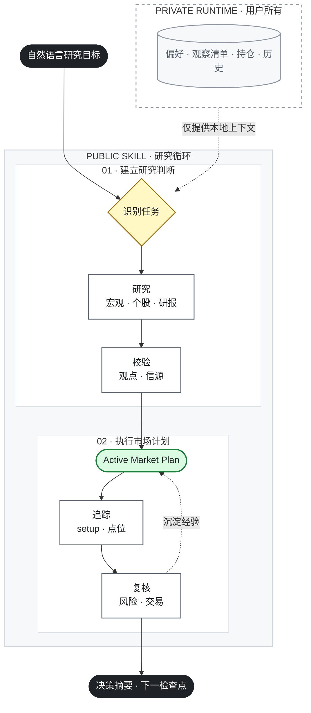

[English](README.md) | [简体中文](README.zh-CN.md)

# DailyTrades：交易投研系统

一个 AI-native 研究 Skill，把市场、宏观、政策、公司、Price Action 和组合证据压缩成可持续更新的决策流程。

版本：`0.1.1`

## 30 秒安装

安装完整的 portable Agent Skill。安装器会检测支持的 coding agent 并适配目标目录。

```bash
npx skills@latest add Archerouyang/dailytrades --skill trading-research-system -g
```

## 首次使用

新开一个任务并发送：

```text
开始今日交易研究
```

同一个 Skill 会先检查 runtime health；如果不存在 private runtime，就自动进入空白首次设置，确认本地 runtime 位置，并询问是否启用可选的授权只读数据源。它不会恢复或推断观察清单、交易偏好、持仓、计划、凭据、connector 授权或研究历史。

## 拟议 Canonical Research Board Gallery

仅在 staging 中。以下合成、非交互截图与 Codex 和 Claude Code 使用的同一份 canonical HTML 通过哈希关联。

### Instrument Research

[打开 canonical HTML](docs/assets/canonical-gallery/artifacts/instrument-research/research-brief.html) · 非交互截图 · 合成 fixture

### Macro Regime

[打开 canonical HTML](docs/assets/canonical-gallery/artifacts/macro-regime/research-brief.html) · 非交互截图 · 合成 fixture

### Portfolio Risk

[打开 canonical HTML](docs/assets/canonical-gallery/artifacts/portfolio-risk/research-brief.html) · 非交互截图 · 合成 fixture

## 工作流



用户只需用自然语言描述研究目标，Skill 会自主选择内部 workflow；新用户不需要记住 focused workflow 名称。

## 能力与数据来源

| 能力 | Skill 输出 | 信源规则 |
| --- | --- | --- |
| 周度与每日市场研究 | Active Market Plan 变化、事件优先级和下一步 | 校验当前事实，只展示影响决策的变化 |
| 宏观、利率与政策 | 市场环境、传导路径和受影响计划 | 官方一手信源优先；授权 macrodata 提供指标值 |
| 个股与研报研究 | thesis、counter-thesis、Claim Ledger、Verification Queue | 只使用公开、已授权或用户提供的内容，不绕过付费墙 |
| Price Action | 明确时间框架、趋势/震荡环境、点位和 setup 条件 | 使用授权 OHLCV；canonical 图表使用 TradingView Lightweight Charts |
| Alpha Lab 输入 | 用于研究排序的已发布 champion 排名、历史变化和不确定性 | 只读私有 store；保留模型排名，不可用时安全降级 |
| 组合风险 | 集中度、产品、主题、券商暴露和重大风险旗标 | 授权只读 broker facts 或用户明确提供的数据 |
| 交易复盘 | 下单后与平仓后的背景、错误和经验 | 只读成交事实加用户确认 |

私有 Alpha Lab 可用时，Skill 只把已发布的 champion 排名作为研究优先级输入，不会在 agent 内训练或重排模型。Alpha 契约与自动化细节见 [Alpha Lab 计划](docs/ALPHA_LAB_PLAN.md)。

本系统只提供决策支持，不保证收益，不替代受监管的投资建议，也不会把单个数据点直接转成交易指令。

## Public Skill / Private Runtime

| Public Skill | Private Runtime |
| --- | --- |
| 一个可安装的 `trading-research-system` 包，包含 workflow、references、scripts、空白模板和合成 fixtures | 用户自己的交易偏好、观察清单、持仓、Active Market Plan、setup、复盘、凭据和 connector 授权 |
| 可以公开发布和升级 | 始终位于公开仓库和分发包之外 |
| 不内置个人默认值 | 只有用户明确授权本地写入后才创建 |

安装和升级绝不会复制、推断、同步或恢复 private state。券商和行情集成是可选能力，必须单独授权且只读。**No order actions：**Skill 永远不会创建、修改、取消或提交真实订单。

## 可选 Native Plugins

上面的 portable Agent Skill 是主分发方式。Codex 与 Claude Code native plugin 只是对同一公共 Skill 的可选托管 wrapper；它们没有第二套行为源，也不会同步 private state。

**Codex**

```bash
codex plugin marketplace add Archerouyang/dailytrades --ref master
```

然后在 `/plugins` 或 Codex Plugins 页面安装 `trading-research-system`。

**Claude Code**

```text
/plugin marketplace add Archerouyang/dailytrades
/plugin install trading-research-system@dailytrades
```

安装或升级 native wrapper 后需要 reload 或新开任务。

## 故障排查与详细文档

| 现象 | 检查 |
| --- | --- |
| 找不到 Skill | 确认仓库可访问，并检查安装输出是否只列出 `trading-research-system`。 |
| 新任务没有个人数据 | 这是预期行为；首次运行保持空白，直到用户明确初始化 private runtime。 |
| 券商或宏观数据不可用 | 单独授权对应的可选只读来源；安装 Skill 不会授予 connector 权限。 |
| 无法截图图表 | canonical PNG 需要 Chrome/Chromium；生成的 SVG 只作为无浏览器 fallback。 |

详细文档：[Plugin 使用说明](plugins/trading-research-system/README.md)、[工作流设计](docs/PLUGIN_DESIGN.md)、[MVP Runbook](docs/MVP_RUNBOOK.md) 和[分发决策](docs/adr/0007-command-first-agent-skill-distribution.md)。

DailyTrades 使用 MIT License；第三方组件保留各自许可证。
